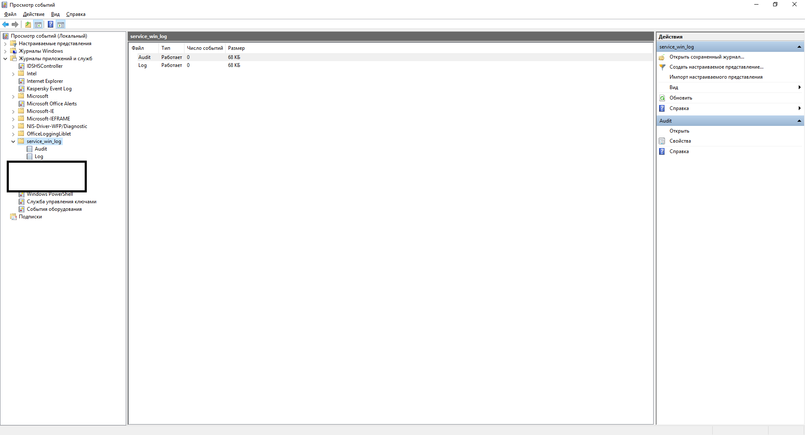

Sample for resolving stack overflow [issue](https://stackoverflow.com/questions/58727573/why-i-have-empty-windows-logs-after-success-eventwrite-function-call)
==========================================================================================

Problem description
===================
The project is the sample Windows service.

Service run under [LocalService account](https://docs.microsoft.com/en-us/windows/win32/services/localservice-account)

Service must write several events to the [Windows Events Log](https://docs.microsoft.com/en-us/windows/win32/wes/windows-event-log) via [Instrumentation Manifest](https://docs.microsoft.com/en-us/windows/win32/wes/writing-an-instrumentation-manifest) and shutdown if error occured:

        if (EventWrite(log_handle, &SERVICE_LOG_FATAL, 1, &data) != ERROR_SUCCESS ||
            EventWrite(log_handle, &SERVICE_LOG_CRITICAL, 1, &data) != ERROR_SUCCESS ||
            EventWrite(log_handle, &SERVICE_LOG_WARNING, 1, &data) != ERROR_SUCCESS ||
            EventWrite(log_handle, &SERVICE_LOG_INFO, 1, &data) != ERROR_SUCCESS ||
            EventWrite(log_handle, &SERVICE_LOG_DEBUG, 1, &data) != ERROR_SUCCESS ||
            EventWrite(log_handle, &SERVICE_LOG_TRACE, 1, &data) != ERROR_SUCCESS ||
            EventWrite(log_handle, &SERVICE_AUDIT_SUCCESS, 1, &data) != ERROR_SUCCESS ||
            EventWrite(log_handle, &SERVICE_AUDIT_FAILURE, 1, &data) != ERROR_SUCCESS)
        {
            is_shutdown = true;
        }

The service works fine, but event logs are empty:

How to reproduce:
=================
Run under user:

        mkdir build_dir
        cd build_dir
        cmake build ..
        
Run under admin:

        register_log.cmd
        create_service.cmd
        net start service_win

